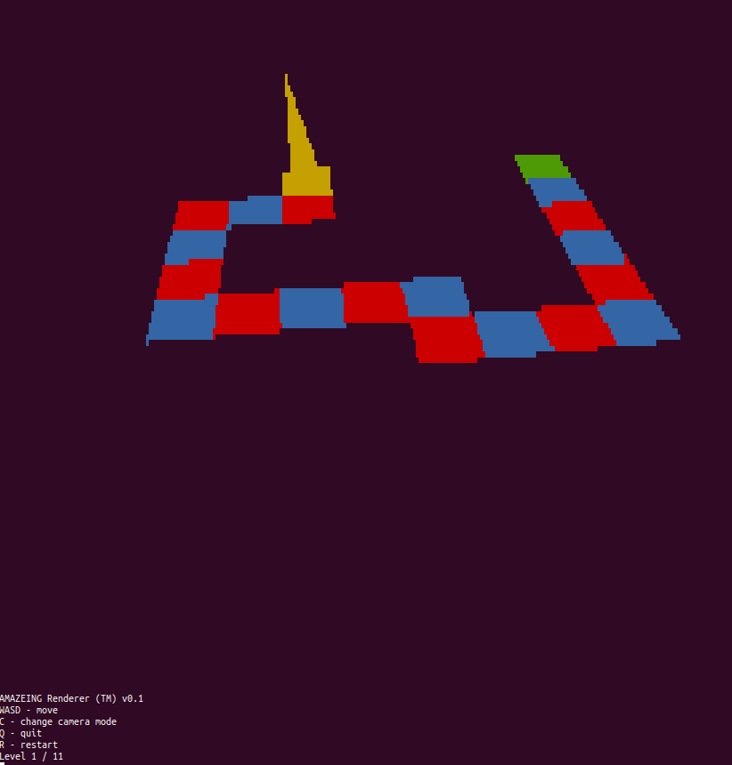

# The Impossible Maze

A challenge I made for [Crusaders of Rust CTF 2023](https://2023.cor.team/).

There are eleven mazes, each fitting in an 8 by 8 grid. Some are solvable on sight. Others necessitate reversing (parts of) the source code to find the correct path. Well that, or some serious trial and error. Upon completing the eleventh maze the flag is displayed. To force people to solve the maze, the flag only displays given the correct hash of the player's route (across all levels).

The challenge is not intended to be terribly difficult: Just run `strings` on the binary and look for the mazes, which are already in a human-readable ASCII format. You can also just guess the final hash value with (say) an SMT solver, because the hash function is terrible (unintended). It was an amusing way for me to learn ncurses (a popular library for terminal-based GUIs) and basic 3D graphics. The code's quality is commensurate with the two-and-a-half days I took to write the challenge, ending 16 hours before the CTF start.
